# Student Account Linking (Invite Code System)

This document describes the invite code system that allows parents to link their children's student accounts to family member records.

## Overview

Students need to be linked to their family member record to view their enrolled classes. Parents generate an invite code which students redeem to establish this link.

## User Flow

```mermaid
sequenceDiagram
    Parent->>Family Page: Click "Generate Student Link Code"
    Family Page-->>Parent: Display 6-char code (e.g., ABC123)
    Parent->>Student: Share code
    Student->>Dashboard: Enter code
    Dashboard->>Database: Link account
    Database-->>Student: Success → sees enrolled classes
```

## How It Works

### For Parents (`/parent/family`)

1. Navigate to Family Members page
2. Find your child's card and click **"Generate Student Link Code"**
3. A 6-character code appears (e.g., `ABC123`)
4. Share this code with your child
5. Once redeemed, the card shows a "Linked" badge

> **Note:** Codes expire after 7 days. You can regenerate if needed.

### For Students (`/student`)

1. Log in with your student account
2. If not linked, you'll see a prompt to enter an invite code
3. Enter the 6-character code from your parent
4. On success, you're redirected to see your enrolled classes

## Database Schema

### `family_member_invites` table

| Column | Type | Description |
|--------|------|-------------|
| `code` | TEXT | Unique 6-character alphanumeric code |
| `family_member_id` | UUID | Links to the family member record |
| `expires_at` | TIMESTAMP | 7-day expiry from generation |
| `redeemed_at` | TIMESTAMP | When the code was used |
| `redeemed_by` | UUID | The student who redeemed it |

### `family_members.user_id` column

Links a family member record to a student's `profiles.id`.

## Server Actions

| Action | Description |
|--------|-------------|
| `generateFamilyInviteCode(familyMemberId)` | Parent generates code for a child |
| `redeemFamilyInviteCode(code)` | Student redeems code to link account |
| `getActiveInviteCode(familyMemberId)` | Get existing active code for display |

## UI Components

| Component | Location | Purpose |
|-----------|----------|---------|
| `InviteCodeButton` | Parent family page | Generate & copy codes |
| `RedeemInviteCodeForm` | Student dashboard | Enter code to link |

## RLS Policies

- **Students** can view their own family member record (via `user_id`)
- **Students** can view their own enrollments
- **Parents** can manage invite codes for their children
- All linking operations use service role to bypass RLS

## Demo Accounts

| Email | Password | Role | Status |
|-------|----------|------|--------|
| `jane@example.com` | `password123` | Student | Pre-linked to family |
| `john@example.com` | `password123` | Parent | Has one unlinked child with code `JACK23` |
