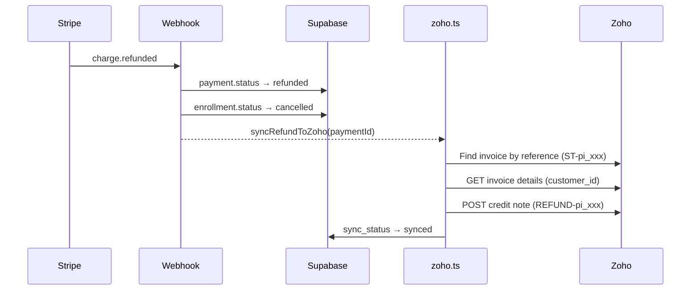

# Zoho Refund Sync — Walkthrough

## What Changed

When a Stripe `charge.refunded` event fires, the system now syncs the refund to Zoho Books as a **credit note** linked to the original invoice's customer. The credit note serves as the standalone refund record — paid invoices cannot have credits applied (Zoho error 12006).

### Files Modified

| File                                                   | Change                                                  |
| ------------------------------------------------------ | ------------------------------------------------------- |
| `src/lib/zoho.ts`                                      | Added `syncRefundToZoho()` + 3 helper functions         |
| `src/app/api/webhooks/stripe/route.ts`                 | Added async Zoho sync call in `charge.refunded` handler |
| `src/app/api/webhooks/stripe/__tests__/stripe.test.ts` | Added test + fixed `FakeQueryBuilder`                   |

### Refund Flow



### Bug Fixes (Bonus)

- Removed `zoho_invoice_id` and `sync_error` from production `syncPaymentToZoho` update calls — these columns don't exist in the `payments` table, causing silent update failures

## Test Results

```
✓ should return 400 if signature is missing (3ms)
✓ should handle checkout.session.completed and update database (37ms)
✓ should handle checkout.session.expired and update payment status (1ms)
✓ should handle charge.refunded and trigger Zoho refund sync (2ms)

Test Files  1 passed (1)
Tests       4 passed (4)
```
