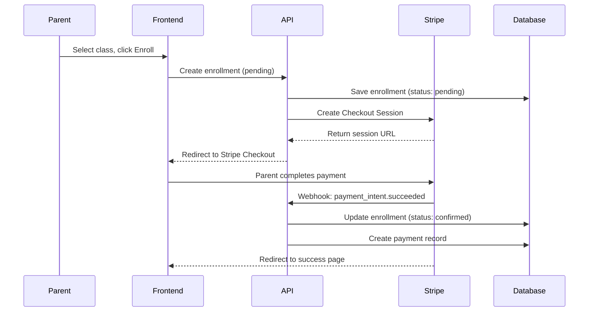
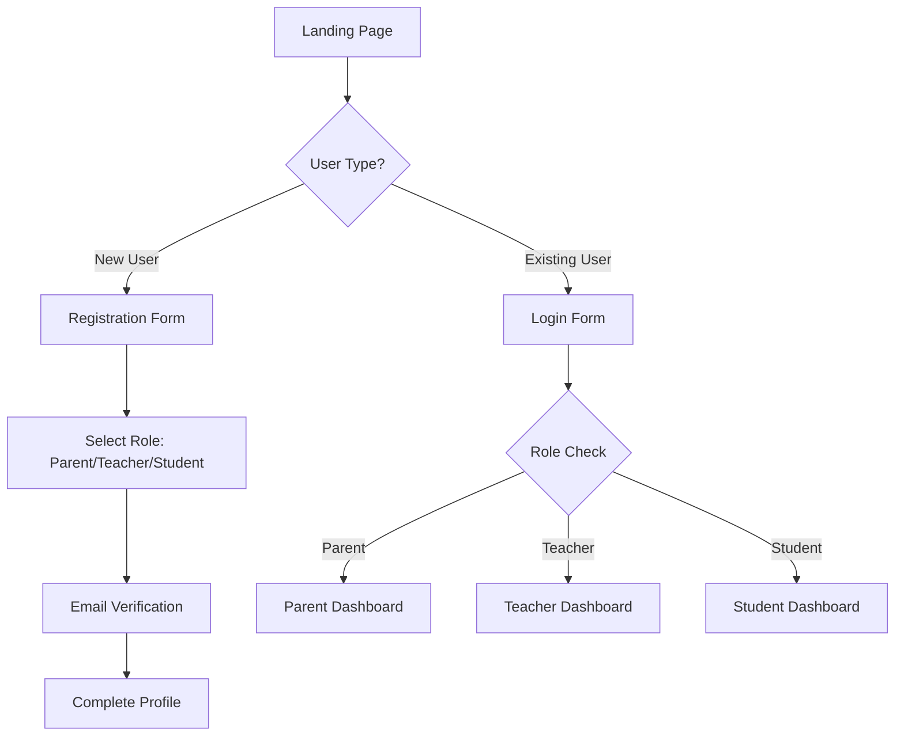
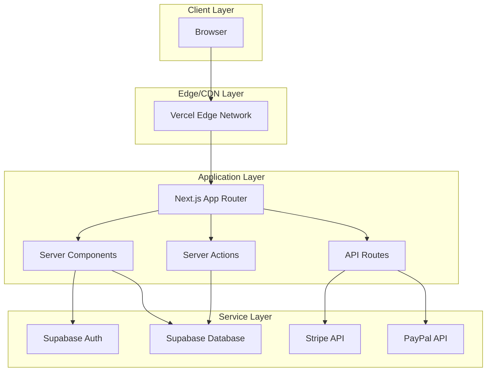
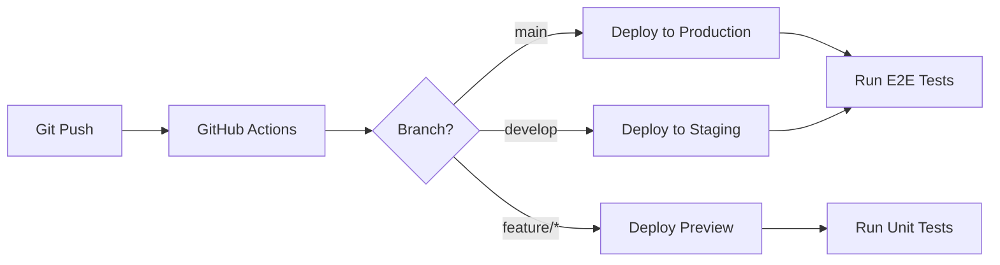

# Architecture Decision Document
## Class Registration System

---

## Executive Summary

This document outlines the architectural decisions for building a class registration system for middle and high school students. The system is primarily a **CRUD web application** with the following core capabilities:

- **User authentication** for parents, teachers, and students
- **Family management** (parents, children, contact information)
- **Class creation and management** by teachers
- **Class enrollment** by parents for their children
- **Schedule viewing** for students
- **Payment processing** for class registration fees

---

## User Review Required

> [!IMPORTANT]
> **Technology Stack Selection**: The recommendations below favor **Next.js** with **Vercel** hosting and **Stripe** for payments. Please review the alternatives and confirm or redirect based on budget constraints, team expertise, or other factors.

> [!IMPORTANT]
> **Database Choice**: This document recommends **Supabase** (PostgreSQL) for its built-in auth and real-time capabilities. If you have existing database infrastructure or prefer a different approach, please provide guidance.

---

## System Requirements Summary

Based on [REGISTRATION_SYSTEM_DESCRIPTION.md](file:///Users/jam/Documents/repos-personal/class-registration-system/REGISTRATION_SYSTEM_DESCRIPTION.md):

| Entity | Description |
|--------|-------------|
| **Student** | Middle/high school students who can view schedules, class materials, and locations |
| **Parent** | Can login, manage family info, enroll children in classes, make payments |
| **Teacher** | Can login, create classes, view their classes, schedules, and enrolled students |
| **Class** | Has schedule, materials/syllabus, location, teacher, and enrolled students |
| **Family** | Parents can have multiple family members; students can have multiple family members |

---

## Decision 1: Hosting Platform

### Options Evaluated

| Platform | Best For | CRUD Suitability | Pricing Model |
|----------|----------|------------------|---------------|
| **Netlify** | Jamstack, static sites | Good with serverless functions + Netlify DB | Credit-based, generous free tier |
| **Vercel** | Next.js, React apps | Excellent with Vercel Postgres | Credit-based, free tier available |
| **Render** | Full-stack, Docker apps | Excellent with native PostgreSQL | Transparent pricing, free tier |

### Analysis

#### Netlify
**Pros:**
- Excellent for static/Jamstack sites
- Netlify DB (Neon-powered) for serverless PostgreSQL
- Strong CDN and global edge network
- Good third-party integrations (Supabase, DigitalOcean)

**Cons:**
- Server functions are secondary to static hosting
- Less optimal for highly dynamic CRUD applications
- Can become complex for full-stack apps

#### Vercel
**Pros:**
- Superior developer experience for Next.js
- Integrated serverless functions and Edge Functions
- Vercel Postgres, Redis, and Blob storage
- Fastest cold starts for serverless functions
- Excellent preview deployments and CI/CD

**Cons:**
- Higher costs for heavy dynamic usage
- Primarily optimized for frontend-heavy apps
- Vendor lock-in with Vercel-specific features

#### Render
**Pros:**
- True full-stack platform with persistent services
- Native PostgreSQL with autoscaling
- Docker support for customization
- Traditional server model (easier debugging)
- Competitive, transparent pricing
- Cron jobs for scheduled tasks

**Cons:**
- Less focus on edge/serverless patterns
- Smaller community than Vercel/Netlify
- Manual scaling configuration needed

### Recommendation

**Primary: Vercel** – Best developer experience for a Next.js CRUD application with integrated database services.

**Alternative: Render** – Better choice if you need more control over infrastructure, persistent background workers, or want to avoid serverless patterns.

---

## Decision 2: Full-Stack Framework

### Options Evaluated

| Framework | Base Library | Learning Curve | Ecosystem | CRUD Fit |
|-----------|--------------|----------------|-----------|----------|
| **Next.js 14+** | React | Moderate | Extensive | Excellent |
| **Remix** | React | Moderate | Growing | Excellent |
| **SvelteKit** | Svelte | Low | Smaller | Excellent |

### Analysis

#### Next.js 14+ (App Router)
**Pros:**
- Largest ecosystem and community
- Server Actions for form handling (perfect for CRUD)
- Server Components reduce client-side JS
- Incremental Static Regeneration for performance
- Extensive third-party library support
- Strong TypeScript support

**Cons:**
- App Router can be complex to master
- Opinionated about routing structure
- Some features are Vercel-optimized

#### Remix
**Pros:**
- Progressive enhancement by default
- `loader`/`action` pattern excellent for CRUD
- Nested routing simplifies complex layouts
- Works great with traditional forms
- Better for slow/unstable connections

**Cons:**
- Smaller ecosystem
- Documentation still maturing
- Less community resources for troubleshooting

#### SvelteKit
**Pros:**
- Smallest bundle sizes
- Most intuitive syntax
- Excellent performance out of the box
- Good for rapid prototyping

**Cons:**
- Smallest ecosystem
- Fewer developers in the market
- Less AI/tooling support
- May limit future hiring options

### Recommendation

**Primary: Next.js 14+ with App Router** – Best ecosystem, hiring pool, and integration options for a production CRUD application.

**Alternative: Remix** – Consider if progressive enhancement and form resilience are priorities.

---

## Decision 3: Database

### Options Evaluated

| Database | Type | Auth Built-in | Real-time | Hosting |
|----------|------|---------------|-----------|---------|
| **Supabase** | PostgreSQL | Yes | Yes | Managed |
| **Vercel Postgres** | PostgreSQL | No | No | Managed |
| **PlanetScale** | MySQL | No | No | Managed |
| **Render PostgreSQL** | PostgreSQL | No | No | Managed |

### Recommendation

**Primary: Supabase** – Provides PostgreSQL with built-in authentication, Row Level Security, real-time subscriptions, and a generous free tier. Excellent fit for this application.

**Alternative: Vercel Postgres** – Better if you want tight Vercel integration without additional services.

### Data Model Overview

```mermaid
erDiagram
    USER ||--o{ FAMILY_MEMBER : "has"
    USER ||--o{ CLASS : "teaches"
    FAMILY_MEMBER ||--o{ ENROLLMENT : "has"
    CLASS ||--o{ ENROLLMENT : "has"
    CLASS ||--|| TEACHER : "taught by"
    ENROLLMENT ||--o| PAYMENT : "requires"
    
    USER {
        uuid id PK
        string email UK
        string role "parent|teacher|student"
        string phone
        timestamp created_at
    }
    
    FAMILY_MEMBER {
        uuid id PK
        uuid parent_id FK
        string first_name
        string last_name
        string grade_level
        string relationship "child|spouse|other"
    }
    
    CLASS {
        uuid id PK
        uuid teacher_id FK
        string name
        text description
        text syllabus
        string location
        timestamp start_time
        timestamp end_time
        string recurrence
        int max_students
        decimal fee
    }
    
    ENROLLMENT {
        uuid id PK
        uuid student_id FK
        uuid class_id FK
        string status "pending|confirmed|cancelled"
        timestamp enrolled_at
    }
    
    PAYMENT {
        uuid id PK
        uuid enrollment_id FK
        decimal amount
        string status "pending|completed|refunded"
        string payment_provider
        string transaction_id
        timestamp paid_at
    }
```

---

## Decision 4: Payment Integration

### Options Evaluated

| Provider | Online | In-Person | API Quality | Fees | School Use |
|----------|--------|-----------|-------------|------|------------|
| **Stripe** | Excellent | Good | Best | 2.9% + $0.30 | Excellent |
| **Square** | Good | Excellent | Good | 2.6% + $0.10 | Good |
| **PayPal** | Good | Limited | Good | 2.9% + $0.49 | Good |

### Analysis

#### Stripe
**Pros:**
- Best-in-class API and documentation
- Excellent developer experience
- Stripe Connect for marketplace payments (teacher payments)
- Stripe Checkout for secure hosted payment pages
- Subscription support for recurring classes
- Strong fraud prevention
- 135+ currency support

**Cons:**
- Slightly higher transaction fees
- No point-of-sale hardware focus
- Requires development resources for advanced customization

#### Square
**Pros:**
- Excellent for in-person payments (school events)
- Strong inventory management
- Lower per-transaction fees
- Good invoicing features

**Cons:**
- API less flexible than Stripe
- Primarily designed for small businesses with physical presence
- Fewer currency options

#### PayPal
**Pros:**
- Highest brand recognition
- Parents likely already have accounts
- Good for international payments
- Buyer protection increases trust

**Cons:**
- Higher chargeback fees ($20 vs $15)
- Less modern API experience
- Account holds can be problematic
- Less suitable for recurring payments

### Recommendation

**Primary: Stripe** – Best API, developer experience, and features for a registration system.

**Secondary: PayPal** – Add as an alternative payment option for parents who prefer it.

### Payment Flow Architecture



---

## Decision 5: Authentication

### Recommendation

**Supabase Auth** – Integrated with Supabase database, provides:

- Email/password authentication
- Magic link authentication
- OAuth providers (Google, Facebook)
- Role-based access (parent, teacher, student)
- Row Level Security integration
- Session management

### User Flow



---

## Decision 6: UI Component Library

### Recommendation

**shadcn/ui** – A collection of accessible, customizable components built on Radix UI primitives.

**Why shadcn/ui:**
- Copy-paste components (no dependency)
- Full control over styling
- Built for accessibility
- Tailwind CSS integration
- Active community
- Perfect for CRUD forms and tables

---

## Technology Stack Summary

| Layer | Technology | Rationale |
|-------|-----------|-----------|
| **Frontend** | Next.js 14+ (App Router) | Server Components, Server Actions, best ecosystem |
| **Styling** | Tailwind CSS + shadcn/ui | Rapid development, accessible components |
| **Database** | Supabase (PostgreSQL) | Built-in auth, RLS, real-time, generous free tier |
| **Authentication** | Supabase Auth | Integrated with database, multiple providers |
| **Payments** | Stripe (primary) + PayPal (optional) | Best API, Connect for marketplace |
| **Hosting** | Vercel | Optimal for Next.js, easy deployment |
| **ORM** | Prisma or Drizzle | Type-safe database queries |

---

## Architecture Diagram



---

## Deployment Strategy

### Environments

| Environment | Purpose | URL Pattern |
|-------------|---------|-------------|
| Development | Local development | `localhost:3000` |
| Preview | PR previews, testing | `pr-{number}.vercel.app` |
| Staging | Pre-production testing | `staging.{domain}.com` |
| Production | Live application | `{domain}.com` |

### CI/CD Pipeline



---

## Cost Estimates (Monthly)

| Service | Free Tier | Paid Estimate |
|---------|-----------|---------------|
| Vercel | Generous free tier | ~$20/mo (Pro) |
| Supabase | 500MB DB, 1GB bandwidth | ~$25/mo (Pro) |
| Stripe | No monthly fee | 2.9% + $0.30 per transaction |

**Estimated Monthly Cost (Initial):** $0 - $50 depending on usage

---

## Next Steps

1. ✅ Review and approve this architecture document
2. ⏳ Review the API Planning Document (OpenAPI specification)
3. ⏳ Set up development environment
4. ⏳ Create database schema and migrations
5. ⏳ Implement authentication flow
6. ⏳ Build core CRUD operations
7. ⏳ Integrate payment processing
8. ⏳ Deploy to staging environment

---

## Appendix: Alternative Considerations

### If Budget is Extremely Limited

Consider **Render** with a traditional Express.js or Fastify backend, which offers:
- Free PostgreSQL (with limitations)
- Simple Docker deployments
- No cold starts
- More predictable costs

### If Hiring is a Concern

Stick with **React/Next.js** – larger talent pool and more resources available.

### If International Payments are Critical

Add **PayPal** alongside Stripe, or consider **Stripe** with localized payment methods enabled.
