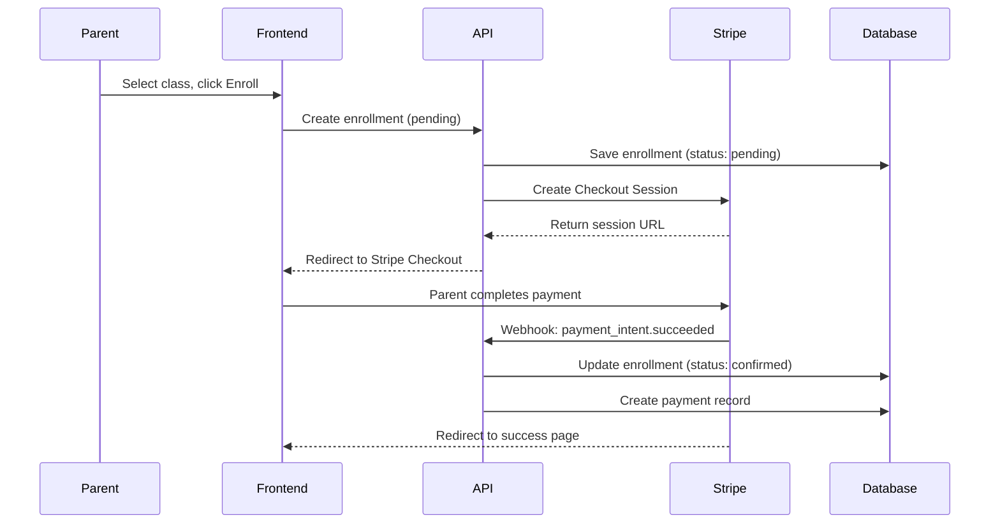
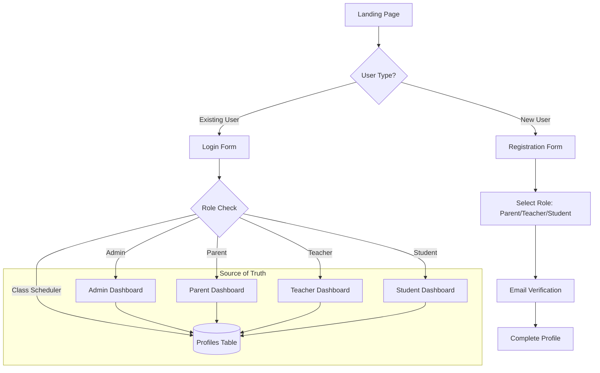
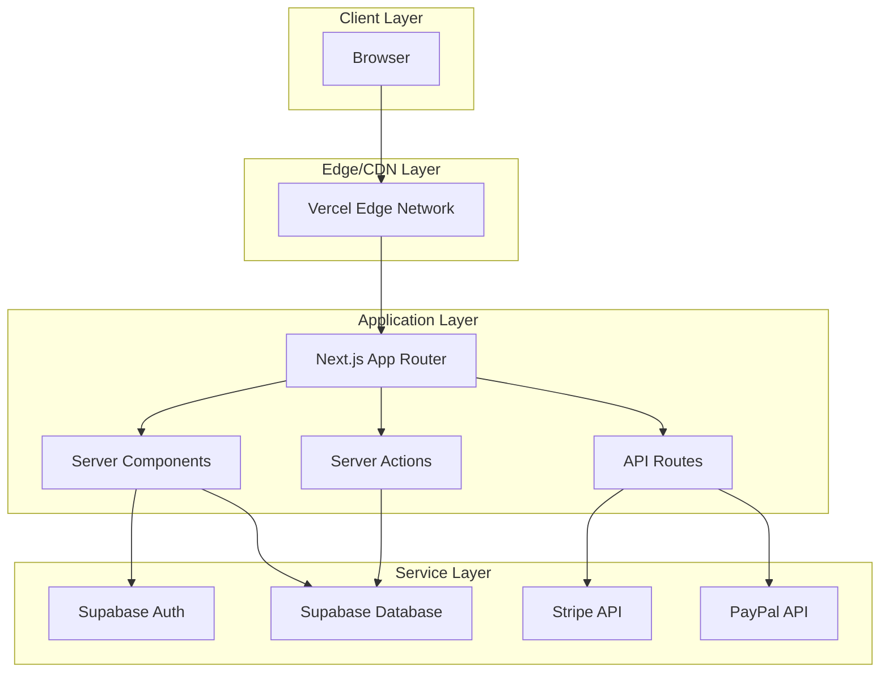
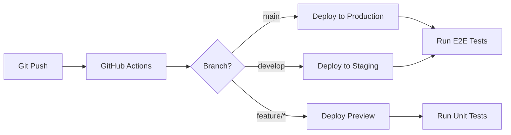

# Architecture Decision Document

## Class Registration System

---

## Executive Summary

This document outlines the architectural decisions for building a class registration system for middle and high school students. The system is primarily a **CRUD web application** with the following core capabilities:

- **User authentication** for parents, teachers, and students
- **Family management** (parents, children, contact information)
- **Class creation and management** by teachers and class schedulers
- **Class enrollment** by parents for their children
- **Schedule viewing** for students
- **Payment processing** for class registration fees

---

## User Review Required

> [!IMPORTANT]
> **Technology Stack Selection**:
> **Next.js** with **Vercel** hosting and **Stripe** for payments.

> [!IMPORTANT]
> **Database Choice**:
> **Supabase** (PostgreSQL) for its built-in auth and real-time capabilities.

---

## System Requirements Summary

Based on [REGISTRATION_SYSTEM_DESCRIPTION.md](docs/REGISTRATION_SYSTEM_DESCRIPTION.md):

| Entity              | Description                                                                                                                          |
| ------------------- | ------------------------------------------------------------------------------------------------------------------------------------ |
| **Student**         | Can login, view schedules, class materials, and locations                                                                            |
| **Parent**          | Can login, manage family info, enroll children in classes, make payments                                                             |
| **Teacher**         | Can login, create classes, view their classes, schedules, and enrolled students                                                      |
| **Class Scheduler** | Can login, create classes, view every teacher's classes, schedules, and enrolled students                                            |
| **Super Admin**     | **God Mode** access. Can access ALL portals (Admin, Teacher, Scheduler, Parent) via a global view switcher. Bypass all RLS policies. |
| **Class**           | Has schedule, materials/syllabus, location, teacher, and enrolled students                                                           |
| **Family**          | Parents can have multiple family members; students can have multiple family members                                                  |

---

## Decision 1: Hosting Platform

### Options Evaluated

| Platform    | Best For                | CRUD Suitability                            | Pricing Model                     |
| ----------- | ----------------------- | ------------------------------------------- | --------------------------------- |
| **Netlify** | Jamstack, static sites  | Good with serverless functions + Netlify DB | Credit-based, generous free tier  |
| **Vercel**  | Next.js, React apps     | Excellent with Vercel Postgres              | Credit-based, free tier available |
| **Render**  | Full-stack, Docker apps | Excellent with native PostgreSQL            | Transparent pricing, free tier    |

### Analysis

#### Netlify

**Pros:**

- Excellent for static/Jamstack sites
- Netlify DB (Neon-powered) for serverless PostgreSQL
- Strong CDN and global edge network
- Good third-party integrations (Supabase, DigitalOcean)

**Cons:**

- Server functions are secondary to static hosting
- Less optimal for highly dynamic CRUD applications
- Can become complex for full-stack apps

#### Vercel

**Pros:**

- Superior developer experience for Next.js
- Integrated serverless functions and Edge Functions
- Vercel Postgres, Redis, and Blob storage
- Fastest cold starts for serverless functions
- Excellent preview deployments and CI/CD

**Cons:**

- Higher costs for heavy dynamic usage
- Primarily optimized for frontend-heavy apps
- Vendor lock-in with Vercel-specific features

#### Render

**Pros:**

- True full-stack platform with persistent services
- Native PostgreSQL with autoscaling
- Docker support for customization
- Traditional server model (easier debugging)
- Competitive, transparent pricing
- Cron jobs for scheduled tasks

**Cons:**

- Less focus on edge/serverless patterns
- Smaller community than Vercel/Netlify
- Manual scaling configuration needed

### Recommendation

**Selected: Vercel**
We have selected Vercel for its superior Next.js integration, serverless function performance, and preview deployment capabilities which are critical for our CI/CD pipeline.

---

## Decision 2: Full-Stack Framework

### Options Evaluated

| Framework       | Base Library | Learning Curve | Ecosystem | CRUD Fit  |
| --------------- | ------------ | -------------- | --------- | --------- |
| **Next.js 14+** | React        | Moderate       | Extensive | Excellent |
| **Remix**       | React        | Moderate       | Growing   | Excellent |
| **SvelteKit**   | Svelte       | Low            | Smaller   | Excellent |

### Analysis

#### Next.js 14+ (App Router)

**Pros:**

- Largest ecosystem and community
- Server Actions for form handling (perfect for CRUD)
- Server Components reduce client-side JS
- Incremental Static Regeneration for performance
- Extensive third-party library support
- Strong TypeScript support

**Cons:**

- App Router can be complex to master
- Opinionated about routing structure
- Some features are Vercel-optimized

#### Remix

**Pros:**

- Progressive enhancement by default
- `loader`/`action` pattern excellent for CRUD
- Nested routing simplifies complex layouts
- Works great with traditional forms
- Better for slow/unstable connections

**Cons:**

- Smaller ecosystem
- Documentation still maturing
- Less community resources for troubleshooting

#### SvelteKit

**Pros:**

- Smallest bundle sizes
- Most intuitive syntax
- Excellent performance out of the box
- Good for rapid prototyping

**Cons:**

- Smallest ecosystem
- Fewer developers in the market
- Less AI/tooling support
- May limit future hiring options

### Recommendation

**Selected: Next.js 16+ with App Router**
We are using Next.js 16 with Turbopack. The App Router's use of Server Components and Server Actions drastically simplifies our data mutation logic (CRUD), removing the need for a separate API layer for most internal operations.

---

## Decision 3: Database

### Options Evaluated

| Database              | Type       | Auth Built-in | Real-time | Hosting |
| --------------------- | ---------- | ------------- | --------- | ------- |
| **Supabase**          | PostgreSQL | Yes           | Yes       | Managed |
| **Vercel Postgres**   | PostgreSQL | No            | No        | Managed |
| **PlanetScale**       | MySQL      | No            | No        | Managed |
| **Render PostgreSQL** | PostgreSQL | No            | No        | Managed |

### Recommendation

**Selected: Supabase**
Supabase is our choice due to its "backend-in-a-box" features:

- **Auth**: Seamlessly integrated with the database.
- **RLS (Row Level Security)**: Enforces data access policies at the database level, which is critical for our multi-role system (e.g., ensuring Teachers only see their own classes).
- **Service Role Access**: Allows secure admin overrides (used for Student Linking and Super Admin actions).

### Data Model Overview

---

## Decision 4: Payment Integration

### Options Evaluated

| Provider   | Online    | In-Person | API Quality | Fees         | School Use |
| ---------- | --------- | --------- | ----------- | ------------ | ---------- |
| **Stripe** | Excellent | Good      | Best        | 2.9% + $0.30 | Excellent  |
| **Square** | Good      | Excellent | Good        | 2.6% + $0.10 | Good       |
| **PayPal** | Good      | Limited   | Good        | 2.9% + $0.49 | Good       |

### Analysis

#### Stripe

**Pros:**

- Best-in-class API and documentation
- Excellent developer experience
- Stripe Connect for marketplace payments (teacher payments)
- Stripe Checkout for secure hosted payment pages
- Subscription support for recurring classes
- Strong fraud prevention
- 135+ currency support

**Cons:**

- Slightly higher transaction fees
- No point-of-sale hardware focus
- Requires development resources for advanced customization

#### Square

**Pros:**

- Excellent for in-person payments (school events)
- Strong inventory management
- Lower per-transaction fees
- Good invoicing features

**Cons:**

- API less flexible than Stripe
- Primarily designed for small businesses with physical presence
- Fewer currency options

#### PayPal

**Pros:**

- Highest brand recognition
- Parents likely already have accounts
- Good for international payments
- Buyer protection increases trust

**Cons:**

- Higher chargeback fees ($20 vs $15)
- Less modern API experience
- Account holds can be problematic
- Less suitable for recurring payments

### Recommendation

**Selected: Stripe**
Stripe is the exclusive payment provider. We utilize **Stripe Checkout** for PCI compliance and security. The integration relies heavily on **Webhooks** (`checkout.session.completed`) to handle enrollment confirmation and accounting syncs asynchronously. We enforce idempotency on webhooks to prevent duplicate processing.

### Payment Flow Architecture

---

## Decision 5: Authentication

**Selected: Supabase Auth**
Integrated directly with our `profiles` table.

- **Roles**: Stored in `profiles` (public table) as the single source of truth.
- **Triggers**: A generic trigger automatically creates a `profiles` row upon new user registration (`handle_new_user`).
- **Middleware**: Next.js Middleware protects routes based on the role fetched from Supabase.
- Magic link authentication
- OAuth providers (Google, Facebook)
- Role-based access (parent, teacher, student)
- Row Level Security integration
- Session management

### User Flow

---

## Decision 7: Role Source of Truth

### Decision

The `public.profiles` table is the **single source of truth** for user roles and permissions.

### Rationale

Previously, the system partially relied on `user_metadata` within the Supabase Auth session. However, metadata can become stale when a role is changed in the database. By refactoring the `signIn` action and all `layout.tsx` files to fetch the role directly from the `profiles` table:

- Role changes take effect immediately without requiring a logout.
- Direct database updates (e.g., via Admin Portal) are instantly recognized by the application.
- Security is hardened as authorization is verified against the database on every page load.

---

## Decision 8: Multi-Role Portal Access

### Decision

We have implemented a **Profile View Switching** mechanism for multi-role users.

### Rationale

- **Hybrid Roles**: Teachers and Admins are often also Parents.
- **Mechanism**:
  - A persistent cookie `user_view_preference` tracks the current active view.
  - Server Actions (`switchProfileView`) update this preference and redirect the user.
  - **Super Admins** have a special "God Mode" switcher allowing them to access ANY view (Admin, Teacher, Scheduler, Parent) regardless of their base constraints.
- **Constraints**:
  - Regular **Admins** cannot access the **Class Scheduler** view (separation of concerns).
  - **Class Schedulers** cannot be **Teachers** (conflict of interest prevention).

---

## Decision 9: Profile Self-Healing

### Decision

The system implements a "Belt and Suspenders" approach to profile management.

### Rationale

To prevent foreign key violations, every authenticated user must have a profile record.

1. **Hardened Trigger**: The `handle_new_user` Postgres trigger uses `ON CONFLICT DO NOTHING` to prevent registration failures if a profile already exists.
2. **SignIn Fallback**: The `signIn` server action includes a check to verify a profile exists and creates one if it's missing. This handles cases where users are created manually in the Supabase dashboard or if the database trigger fails.

---

## Decision 10: Server Actions vs. API Routes

### Decision

- **Server Actions**: Used for all internal data mutations (Forms, Buttons).
- **API Routes**: Used ONLY for external webhooks (Stripe) and specific data exports (CSV).

### Rationale

Server Actions provide end-to-end type safety and colocate data logic with UI components, reducing the need for a separate API client layer and state management complexity.

---

## Decision 11: Student Linking Strategy

### Decision

**Email-based Linking** (replacing Invite Codes).

### Rationale

- **UX**: Parents simply enter the student's email. If the student exists, they are linked. If not, a pending link is created.
- **Simplicity**: Eliminates the friction of generating, sharing, and redeeming 6-digit codes.
- **Security**: Links are verified against verified email addresses.

---

## Decision 12: Accounting Integration

### Decision

**Zoho Books** via Asynchronous Sync.

### Rationale

- **Performance**: Accounting syncs (creating Invoices/Customers) can be slow. We decouple this from the user's checkout flow.
- **Reliability**: A background process (triggered by Stripe Webhook) handles the sync. Failures are logged for retry, ensuring the user's enrollment is never blocked by accounting API downtime.

---

## Decision 13: UI Library

### Decision

**Tailwind CSS v4 + shadcn/ui**.

### Rationale

- **Tailwind v4**: Faster compilation (Rust-based), zero-config.
- **shadcn/ui**: Copy-paste components give us full ownership of the code while providing accessible, robust primitives (Dialogs, Selects, Forms).

---

## Technology Stack Summary

| Layer          | Technology                  | Rationale                                     |
| -------------- | --------------------------- | --------------------------------------------- |
| **Frontend**   | Next.js 16 (App Router)     | Server Components, Server Actions, Turbopack  |
| **Styling**    | Tailwind CSS v4 + shadcn/ui | Zero-runtime styles, accessible, maintainable |
| **Database**   | Supabase (PostgreSQL)       | Built-in Auth, RLS, Realtime, Triggers        |
| **Payments**   | Stripe                      | Checkout Sessions, Webhooks, Idempotency      |
| **Accounting** | Zoho Books                  | Asynchronous sync via Webhooks                |
| **Email**      | Resend                      | Transactional emails (Receipts, Invites)      |
| **Validation** | Zod                         | Runtime schema validation for Forms & API     |

---

## Architecture Diagram

---

## Deployment Strategy

### Environments

| Environment | Purpose                | URL Pattern              |
| ----------- | ---------------------- | ------------------------ |
| Development | Local development      | `localhost:3000`         |
| Preview     | PR previews, testing   | `pr-{number}.vercel.app` |
| Staging     | Pre-production testing | `staging.{domain}.com`   |
| Production  | Live application       | `{domain}.com`           |

### CI/CD Pipeline

---

## Cost Estimates (Monthly)

| Service  | Free Tier               | Paid Estimate                |
| -------- | ----------------------- | ---------------------------- |
| Vercel   | Generous free tier      | ~$20/mo (Pro)                |
| Supabase | 500MB DB, 1GB bandwidth | ~$25/mo (Pro)                |
| Stripe   | No monthly fee          | 2.9% + $0.30 per transaction |

**Estimated Monthly Cost (Initial):** $0 - $50 depending on usage

---

## Next Steps

1. ✅ Review and approve this architecture document
2. ⏳ Review the API Planning Document (OpenAPI specification)
3. ⏳ Set up development environment
4. ⏳ Create database schema and migrations
5. ⏳ Implement authentication flow
6. ⏳ Build core CRUD operations
7. ⏳ Integrate payment processing
8. ⏳ Deploy to staging environment

---

## Appendix: Alternative Considerations

### If Budget is Extremely Limited

Consider **Render** with a traditional Express.js or Fastify backend, which offers:

- Free PostgreSQL (with limitations)
- Simple Docker deployments
- No cold starts
- More predictable costs

### If Hiring is a Concern

Stick with **React/Next.js** – larger talent pool and more resources available.

### If International Payments are Critical

Add **PayPal** alongside Stripe, or consider **Stripe** with localized payment methods enabled.
