# Profile View Switching Logic

This diagram illustrates the view switching capabilities and access constraints for each user role in the Class Registration System.

```mermaid
graph TD
    classDef view fill:#e1f5fe,stroke:#01579b,stroke-width:2px;
    classDef role fill:#fff9c4,stroke:#fbc02d,stroke-width:2px;
    classDef constraint fill:#ffebee,stroke:#c62828,stroke-width:2px,stroke-dasharray: 5 5;

    %% Roles
    Student(((Student))):::role
    Parent(((Parent))):::role
    Teacher(((Teacher))):::role
    Admin(((Admin))):::role
    Scheduler(((Class Scheduler))):::role
    SuperAdmin(((Super Admin))):::role

    %% Views
    SV[Student View]:::view
    PV[Parent View]:::view
    TV[Teacher View]:::view
    AV[Admin View]:::view
    SchV[Scheduler View]:::view

    %% Formatting
    subgraph "Single Role Users"
        Student -->|Default| SV
        Parent -->|Default| PV
    end

    subgraph "Multi-Role Switching"
        Teacher -->|Default| TV
        Teacher <-->|Toggle| PV

        Admin -->|Default| AV
        Admin <-->|Toggle| PV

        Scheduler -->|Default| SchV
        Scheduler <-->|Toggle| PV
    end

    subgraph "God Mode"
        SuperAdmin -->|Can Access| AV
        SuperAdmin -->|Can Access| SchV
        SuperAdmin -->|Can Access| TV
        SuperAdmin -->|Can Access| PV
        SuperAdmin -->|Universal Switcher| AV & SchV & TV & PV
    end

    %% Constraints
    Constraint1[Constraint: Scheduler != Teacher]:::constraint
    Constraint2[Constraint: Scheduler != Student]:::constraint
    Constraint3[Constraint: Regular Admin != Scheduler View]:::constraint

    Scheduler -.-> Constraint1
    Scheduler -.-> Constraint2
    Admin -.-> Constraint3
```

## Logic Breakdown

| User Role           | Default View   | Available Toggles                           | Restrictions                                          |
| :------------------ | :------------- | :------------------------------------------ | :---------------------------------------------------- |
| **Student**         | Student View   | None                                        | Cannot see any other data.                            |
| **Parent**          | Parent View    | None                                        | Cannot see internal system data.                      |
| **Teacher**         | Teacher View   | Parent View                                 | Cannot access Admin or Scheduler views.               |
| **Admin**           | Admin View     | Parent View                                 | **Cannot** access Scheduler View (Active Constraint). |
| **Class Scheduler** | Scheduler View | Parent View                                 | **Cannot** be a Teacher or Student.                   |
| **Super Admin**     | Admin View     | **ALL** (Admin, Scheduler, Teacher, Parent) | Bypasses all constraints.                             |
