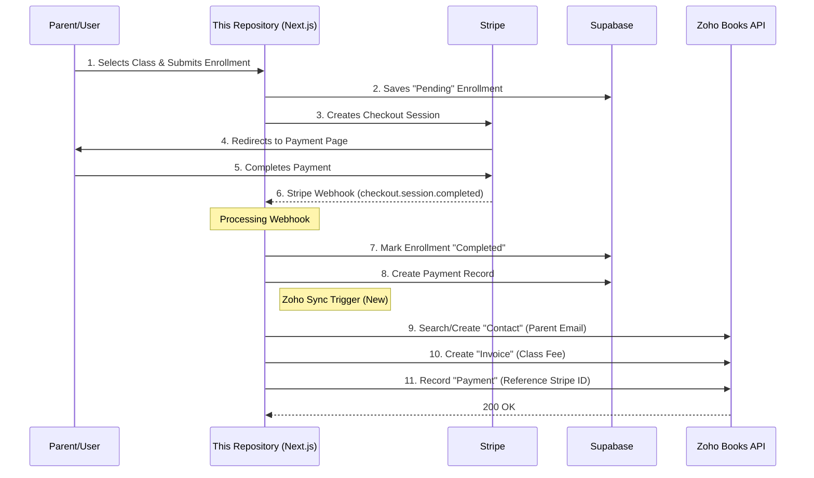

# Zoho Books Integration Flow

This plan outlines the data flow from the `class-registration-system` to Zoho Books, ensuring that Stripe payments are correctly recorded for accounting.

## Architecture Diagram

## Data Mapping

| Local Entity | Zoho Entity | Key Fields |
| :--- | :--- | :--- |
| **Profile (Parent)** | **Contact** | email, first_name, last_name, phone |
| **Class** | **Item** | name, fee (as rate) |
| **Enrollment** | **Invoice** | invoice_number (Local ID), contact_id |
| **Payment (Stripe)** | **Customer Payment** | amount, date, reference_number (Stripe ID) |

## Implementation Strategy

1. **Trigger**: Add a background sync job in [src/app/api/webhooks/stripe/route.ts](file:///Users/jam/Documents/repos-personal/class-registration-system/src/app/api/webhooks/stripe/route.ts) after the Supabase database write is successful.
2. **Error Handling**: Use a "sync_status" column in your `payments` table to track whether the Zoho sync succeeded, allowing for retries if the Zoho API is down.
3. **Queueing**: For high volume, a queue (like Inngest or Upstash) would be ideal, but for starters, a asynchronous fetch call in the webhook handler is sufficient.
